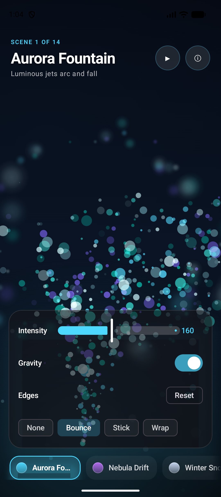
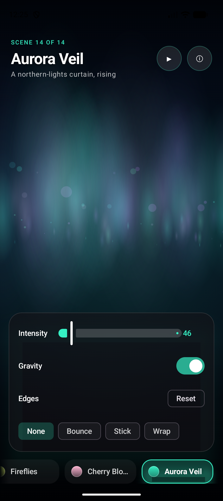
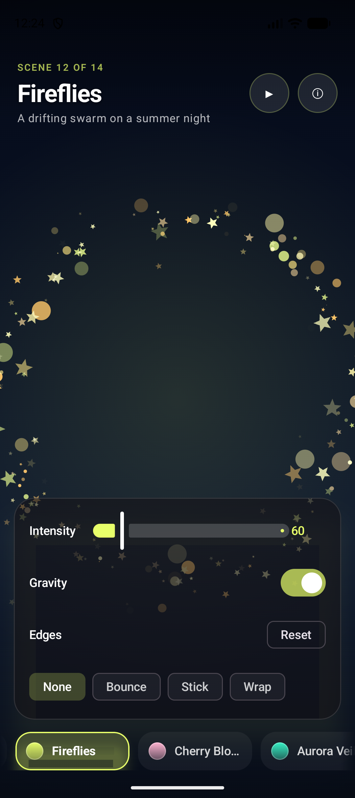
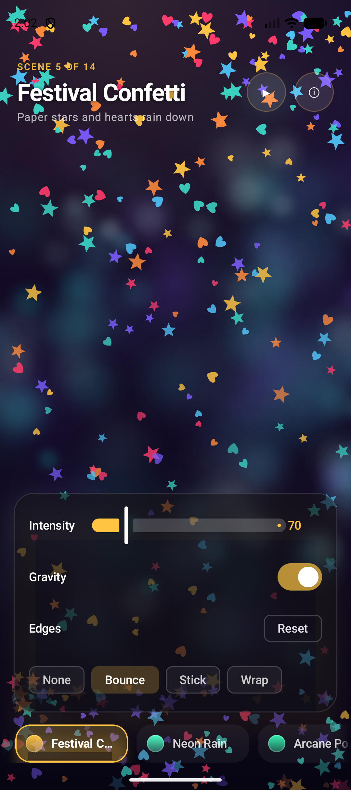
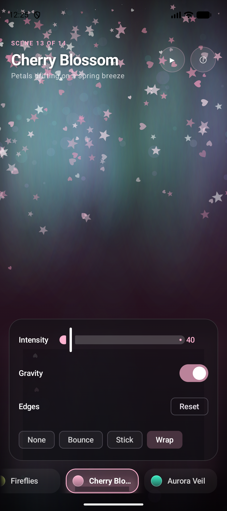
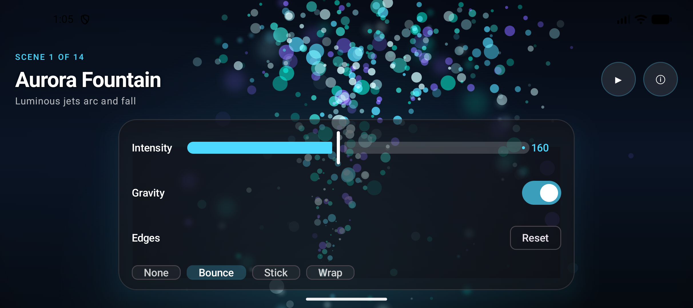

# Particle Studio

An immersive, full-screen **Jetpack Compose** showcase of the
[`io.github.piotrprus:particle-emitter`](https://github.com/PiotrPrus/ParticleEmitter)
engine — a gallery of **14 hand-tuned particle scenes** that together exercise *every*
feature of the library, wrapped in a polished, layered, fully-interactive Material 3 UI.

The entire app is a single live stage: **one** `CanvasParticleEmitter` fills the screen,
and switching scenes only swaps its `config`. Because the emitter re-reads its config every
frame, scene changes dissolve gracefully (in-flight particles from the old scene finish
their life as the new one is born), live controls update instantly, and the whole thing
stays allocation-light.

<!-- Fixed-width  so every thumbnail renders at the same scale regardless of the
     source PNG dimensions (a plain Markdown image table sizes columns to the widest image). -->
<table>
  <tr>
    <td align="center" width="33%"><br><sub><b>Aurora Fountain</b></sub></td>
    <td align="center" width="33%"><br><sub><b>Aurora Veil</b></sub></td>
    <td align="center" width="33%"><br><sub><b>Fireflies</b></sub></td>
  </tr>
  <tr>
    <td align="center"><br><sub><b>Festival Confetti</b></sub></td>
    <td align="center"><br><sub><b>Cherry Blossom</b></sub></td>
    <td align="center"><br><sub><b>Landscape</b></sub></td>
  </tr>
</table>

---

## Features

### The 14 scenes
Each scene is a `SceneSpec` data row in [`SceneCatalog.kt`](app/src/main/java/com/example/myapplication1/studio/SceneCatalog.kt).
Collectively they cover the full engine surface:

| Scene | Showcases |
|---|---|
| **Aurora Fountain** | `POINT` region, gravity-down arcs, `Bounce` floor, Screen glow, sway motion |
| **Nebula Drift** | `OVAL` region, tinted `Image` bokeh, `hideInStartRegion`, 360° spread, drift |
| **Winter Snowfall** | full-width `H_LINE`, gentle gravity, `Wrap` edges |
| **Ember Flame** | `RECT` base, gravity-**up** buoyancy, shrink-to-nothing scale, warm glow |
| **Festival Confetti** | `PathShape` stars + hearts that rotate, opaque `SrcOver`, `Bounce` |
| **Neon Rain** | `Image` streak drops, strong gravity, `Bounce` splash |
| **Arcane Portal** | ring emitter + `hideInStartRegion`, `Plus` blend, orbiting sparkles |
| **Emoji Rain** | `Text` particles (real emoji via `TextMeasurer`), rotation |
| **Rising Bubbles** | gravity-up rise, `Wrap`, translucent glow |
| **Meteor Shower** | `V_LINE` corner emitter, angled spread, rotated streak heads |
| **Stardust Wind** | **sideways gravity** (−90°) + **`Lighten`** blend, vertical bob |
| **Fireflies** | gravity-off wandering swarm, twinkle via short matched fade |
| **Cherry Blossom** | rotating pink petals on a wrapping breeze |
| **Aurora Veil** | tall `VEIL` image columns fused into a rising northern-lights curtain |

**Coverage:** all 5 start regions (`POINT/OVAL/RECT/H_LINE/V_LINE`), all 4 particle shapes
(`Circle/PathShape/Image/Text`), all 4 edge behaviours (`None/Bounce/Stick/Wrap` — `Stick`
via the live control), gravity in every direction, every blend mode used in anger
(`SrcOver/Screen/Plus/Lighten`), grow + shrink scale, narrow/wide/360° spread,
`hideInStartRegion`, rotation, and the full easing set.

### Live, hands-on controls
- **Intensity** slider → `particlePerSecond`
- **Gravity** toggle → on/off (keeps each scene's direction)
- **Edge behaviour** chips → `None / Bounce / Stick / Wrap` (this is how `Stick` is demoed live)
- **Drag anywhere** to steer the emitter (a "magic wand"); **tap** to puff a burst
- **Auto-tour** ▶/❚❚ that cruises the gallery (parks when backgrounded)
- **Reset** restores the scene's curated defaults
- An expandable **info panel** describing each scene and what it showcases

### Depth & motion
- A second, slow **parallax dust emitter** behind the main scene for real foreground/background depth
- A **living sky** (slowly drifting colour wash) + an **accent spotlight** that follows the source and tracks intensity
- **Scene-change ripple**, **tap shockwave**, corner **vignette**, and a per-scene **accent crossfade** that re-themes the whole chrome
- **Ambient emitter motion** (sway / orbit / drift / bob) so even an untouched scene stays alive

### Production niceties
- Edge-to-edge, **dark-immersive** layout with inset-aware chrome; controls capped to ≤640 dp on tablets
- **Rotation / process-death safe**: live overrides persist via `rememberSaveable` + savers
- **Reduced-motion** aware (honours `ANIMATOR_DURATION_SCALE`)
- Accessibility: content descriptions, ≥48 dp targets, selection semantics
- A pure-JVM **unit test** pins every scene's engine-contract invariants

---

## Architecture

A flat, dependency-light layout — data, content, rendering, motion, and UI each in one place.

```
app/src/main/java/com/example/myapplication1/
├── MainActivity.kt              # entry; forces dark theme, edge-to-edge
└── studio/
    ├── SceneSpec.kt             # the scene data model + Anchor + ShapeKind + region math
    ├── SceneCatalog.kt          # the 14 curated scenes (pure data)
    ├── ParticleAssets.kt        # procedural glow/streak/veil bitmaps, star/heart paths,
    │                            #   shape resolution, config + backdrop builders
    ├── StudioMotion.kt          # ambient emitter drift (sway/orbit/drift/bob)
    ├── StudioStage.kt           # the live particle plane (isolated for per-frame perf)
    ├── StudioControls.kt        # the live-control panel
    ├── StudioChrome.kt          # top bar, info panel, scene selector, design tokens
    └── ParticleStudioScreen.kt  # thin orchestrator: state, lifecycle, wiring
app/src/test/.../SceneCatalogTest.kt   # JVM invariant tests for the catalog
```

**Why one emitter?** Swapping a config is cheap and lets particles cross-fade between scenes.
The stage is split from the chrome so the per-frame animation (the emitter, the spotlight,
the living sky) never forces the Material 3 controls to recompose — those redraws read
animation state at *draw time* (`drawBehind`) instead of in composition.

---

## Engine notes (conventions verified from the library source)

These are non-obvious and were the difference between a scene working and silently breaking:

- **Angles use two different zero references.** Particle *force* angle `0° = up`
  (`vx = force·sin θ`, `vy = −force·cos θ`); **gravity** angle `0° = down`
  (`gy = +strength·cos θ`). So a fountain fires up *and* falls with `spread ≈ 0` + `gravityAngle = 0`.
- **Scale ranges are `IntRange`** (integer multipliers): grow with `start < target`,
  shrink-to-nothing with `targetScale = 0..0`.
- **`Image` and `Text` particles ignore `particleSizes`** (sized by the bitmap / font);
  only `Circle` (radius = width/2) and `PathShape` use the size list.
- **Particles spawn on a region's *perimeter*** (the OVAL circumference, RECT outline,
  or line), never filling an area.
- **The line-spawn range is asymmetric** in v1.1.0 (`[c − size/2, c + size]`); full-width
  bands are re-centred in `SceneSpec.defaultCenter`/`regionSize` to compensate.
- **The emitter re-reads `config` every frame**, so `config.copy(...)` updates apply live and
  existing particles keep their captured properties.

---

## Build & run

> **Use JDK 21.** This project is on bleeding-edge tooling (AGP `9.3.0-alpha12`,
> Gradle `9.5`, `compileSdk 36.1`, Compose BOM `2026.02.01`). Gradle 9.5 runs on JDK 17–24,
> so a newer JDK (e.g. 25) fails with an unsupported class-file version.

```bash
# from the repo root
JAVA_HOME=/path/to/jdk-21 ./gradlew :app:assembleDebug      # build the APK
JAVA_HOME=/path/to/jdk-21 ./gradlew :app:testDebugUnitTest  # run the catalog tests

# install & launch on a device/emulator
adb install -r app/build/outputs/apk/debug/app-debug.apk
adb shell am start -n com.example.myapplication1/.MainActivity
```

Min SDK 24 · Target SDK 36 · Kotlin 2.2.10 · 100% Jetpack Compose.

---

## License

Personal showcase project. The `particle-emitter` library is © Piotr Prus (Apache-2.0).
